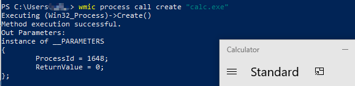

<h1> Tactic: Execution
Technique: Windows Management Instrumentation (T1047)  </h1>
<h2> From MITRE ATT&CK </h2>

Windows Management Instrumentation (WMI) is a Windows administration feature that provides a uniform environment for local and remote access to Windows system components. It relies on the WMI service for local and remote access and the server message block (SMB) and Remote Procedure Call Service (RPCS) for remote access. RPCS operates over port 135. 

An adversary can use WMI to interact with local and remote systems and use it as a means to perform many tactic functions, such as gathering information for Discovery and remote Execution of files as part of Lateral Movement.
<h2> Test </h2>

Name                      | Description                                                  | Reference
------------------------- | -------------------------------------------------------------| ------------
WMI Executing New Process | Simulates adversary leveraging WMI to execute a new process  | N/A 

<h3> Test Development </h3>

<h4> Use WMI to execute calc.exe </h3>


```
wmic process call create "calc.exe"
```
<h3> Test Execution </h3>

Execute the above script in Windows PowerShell: 



The result of the above command execution will be launch of Calculator program.

<h2> Detection </h2>

<h4> Log newly created WMI consumers and processes </h3>

<h5> Download Script </h5> 

**WMIMonitor.ps1**  from https://github.com/realparisi/WMI_Monitor

<h5> Install Script </h5> 
From an elevated Powershell:

```
1. Set-ExecutionPolicy -Scope CurrentUser -ExecutionPolicy Bypass
2. Import-Module .\WMIMonitor.ps1
3. New-EventSubscriberMonitor
```
