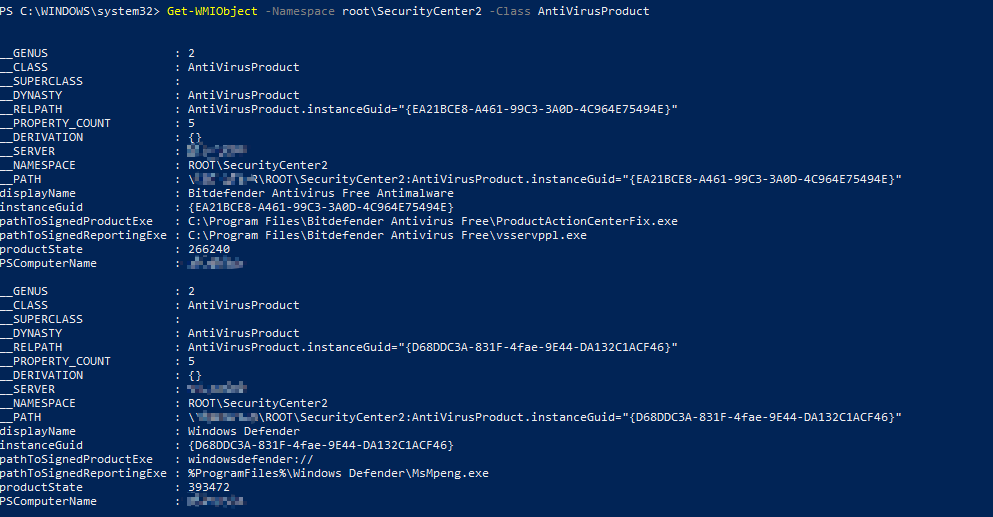

<h1> Tactic: Discovery
Technique: Security Software Discovery (T1063)  </h1>
<h2> From MITRE ATT&CK </h2>

Adversaries may attempt to get a listing of security software, configurations, defensive tools, and sensors that are installed on the system. This may include things such as local firewall rules and anti-virus. Adversaries may use the information from Security Software Discovery during automated discovery to shape follow-on behaviors, including whether or not the adversary fully infects the target and/or attempts specific actions.

<h2> Test </h2>

Name                      | Description                                                             | Reference
------------------------- | ------------------------------------------------------------------------| ------------
PowerShell WMI Execution  | Simulates adversary leveraging PS WMI Script to list Security Software  | N/A 

<h3> Test Development </h3>

<h4> Create a custom Powershell WMI script that lists names of installed security software on the system </h3>


```
Get-WMIObject -Namespace root\SecurityCenter2 -Class AntiVirusProduct
```
<h3> Test Execution </h3>

Execute the above script in Windows PowerShell: 



The output from above will show list of installed security software with additional details such as software's full directory path 

<h2> Detection </h2>

Review MITRE ATT&CK Evaluations to see how various vendors and technologies are detecting this technique:
https://attackevals.mitre.org/technique_comparison.html?round=APT29&step_tid=4.C.7_T1063&vendors=
