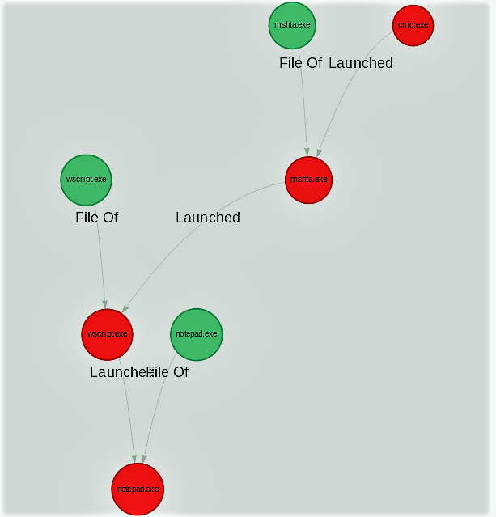

<h1> Tactic: Defense Evasion, Execution
Technique: Mshta (T1170)  </h1>
<h2> From MITRE ATT&CK </h2>

Mshta.exe is a utility that executes Microsoft HTML Applications (HTA). HTA files have the file extension .hta. HTAs are standalone applications that execute using the same models and technologies of Internet Explorer, but outside of the browser.                   Adversaries can use mshta.exe to proxy execution of malicious .hta files and Javascript or VBScript through a trusted Windows utility. There are several examples of different types of threats leveraging mshta.exe during initial compromise and for execution of code.

<h2> Test </h2>

Name                | Description                                                | Reference
------------------- | --------------------------------------------------         | ------------
Local VBScript File | Mshta calls a local VBS file which launches notepad.exe    | 

## Local VBScript File Content
```
Set objShell = WScript.CreateObject("WScript.Shell")
objShell.Run ("%windir%\notepad.exe ")
```
## Execution Command Line 
```
mshta vbscript:Execute("CreateObject(""Wscript.Shell"").Run(""{absolute path to Local VBSfile}\notepad.vbs"")(window.close)")
```


<h2> Detection </h2>

## Sysmon 
Sequential 

EventID | TaskCategory   | User  | SysmonVersion | Image                            |  Commandline | ParentImage
------- | ---------------|-------|---------------|----------------------------------| -------------|----------------------|
1       | ProcessCreate  |User   | 9.1.0         | C:\Windows\System32\mshta.exe    | mshta vbscript:Execute("CreateObject(""Wscript.Shell"").Run(""C:\Users\{USER}\Desktop\new_atomic\notepad.vbs"")(window.close)") | cmd.exe
1       | ProcessCreate  |User   | 9.1.0         | C:\Windows\System32\wscript.exe  |  "C:\windows\System32\WScript.exe" "C:\Users\{USER}\Desktop\new_atomic\notepad.vbs"                                              | mshta.exe
5       | ProcessTerminated  |User   | 9.1.0         | C:\Windows\System32\mshta.exe    | 
1       | ProcessCreate  | User  | 9.1.0         |  C:\Windows\notepad.exe          | "C:\windows\notepad.exe"  |  C:\Windows\System32\wscript.exe 

## Process Tree





